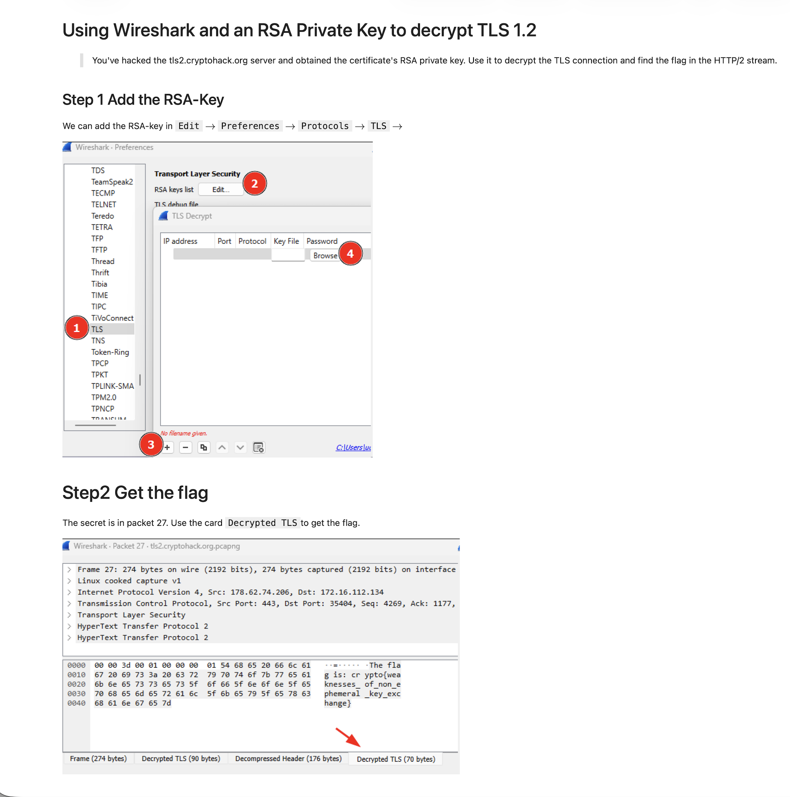

## Explication du challenge

### Pourquoi TLS 1.2 a été remplacé par TLS 1.3 ?

TLS 1.2 expose plus d'informations en clair lors de l'établissement de la connexion, notamment le certificat du serveur et l'échange de clés. TLS 1.3 chiffre ces étapes, renforçant la confidentialité et la sécurité.

- **Certificat en clair** : Dans le paquet 12, le certificat du serveur est visible. Cela permettait aux dispositifs de sécurité réseau d'identifier les connexions, mais ce n'est plus possible avec TLS 1.3.
- **Client Key Exchange** : Dans le paquet 14, le client envoie le "premaster secret" chiffré avec la clé publique RSA du serveur.

### Déchiffrement d'une session TLS 1.2 non-éphémère

Dans ce challenge, la connexion utilise la suite de chiffrement `TLS_RSA_WITH_AES_256_GCM_SHA384`. Grâce à la clé privée RSA du serveur (`privkey.pem`), il est possible de déchiffrer le flux TLS.

#### Procédure avec Wireshark

1. **Ouvrir le fichier PCAP** : Chargez `tls2.cryptohack.org.pcapng` dans Wireshark.
2. **Déchiffrer TLS** :
    - Allez dans `Édition > Préférences > Protocoles > TLS`.
    - Cliquez sur `Fichiers de clés (Key File)` et sélectionnez `privkey.pem`.
    - Wireshark utilisera automatiquement la clé pour déchiffrer les échanges TLS.
3. **Trouver le flag** : Parcourez le flux HTTP/2 déchiffré pour récupérer le flag.

La procédure est disponible ci-dessus.